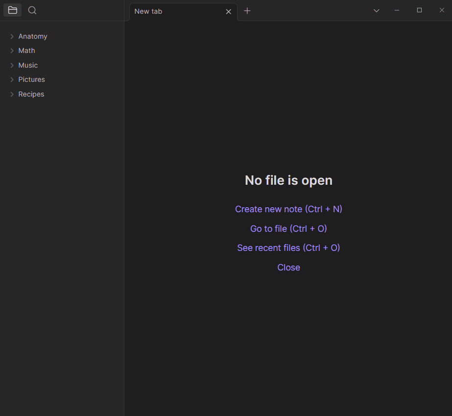

# Obsidian Stylize Plugin

Some assorted features that are useful for using CSS in your vault on a per-page basis.

- Pages receive CSS classes that match their tags, if any
- Pages receive CSS classes that match the names of the folder(s) they're in, if any
- Paragraphs with a tag receive a CSS class that matches the tag name
- Embedded SVG images can now be styled with CSS



Read more on the [wiki](https://github.com/Mangiola/obsidian-stylize/wiki).

## Development Setup

```
npm i
npm run dev
```